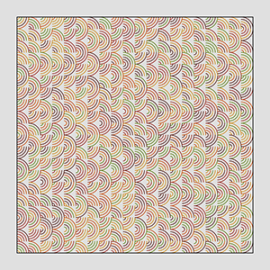

# generative-geometry
A collection of plotting utilities for Python-based generative art.

 

The purpose of this project is to provide a set of reusable tools to create generative art using Python. 

There are three major files:
- **setup.py:** this contains a wrapper class to setup a plotting area for .png, .pdf and .svg image surfaces.
- **plotting.py:** this contains the functions used to plot and shade the generated points onto the image surface.
- **shapes.py:** this is a collection of functions to generate lists of coordinates for various shapes. These points
 can be passed into the plot function to draw points on the image surface.
 
 A bit messy, but powerful enough to create geometric art to plot on my x,y plotter. See more examples
  @theartofdatascience on IG.
  
  Like this project?
    
  
